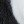
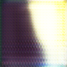

# SRGAN Implementation
[Paper link](https://arxiv.org/pdf/1609.04802.pdf)

## Dataset I used

[DIV2K_train_HR](https://data.vision.ee.ethz.ch/cvl/DIV2K/)\
[DIV2K_validation_HR](https://data.vision.ee.ethz.ch/cvl/DIV2K/)

## Architecture

<hr>

## VGG Loss
The Mean squared error cares only about pixel wire differences and not the [structural differences](https://encrypted-tbn2.gstatic.com/images?q=tbn:ANd9GcQW4X-wQYr_TGW_eT1aN_S_bARMAIezPXaqRfFU9UYZ7SQJRUHM).\
This model uses perceptual loss method in which they have used feature maps from ```pre-trained VGG19```
(basically MSE b/w the feature maps from specific layers).

## Results
SRGAN, being a deep ResNet model requires much computation, I trained it for 100 epochs only.\
Below is the its output on a random crop from a downscaled image from DIV2K_validation_HR

 INPUT \
   OUTPUT